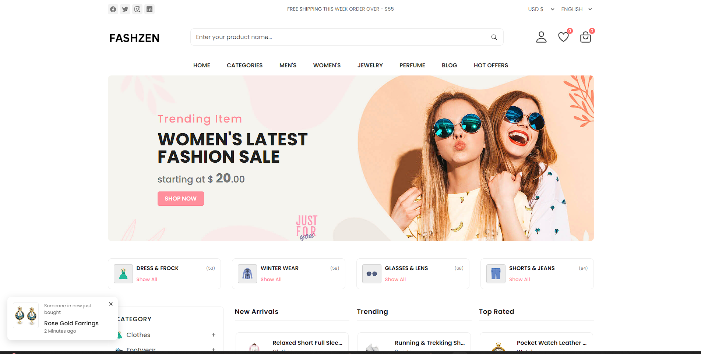
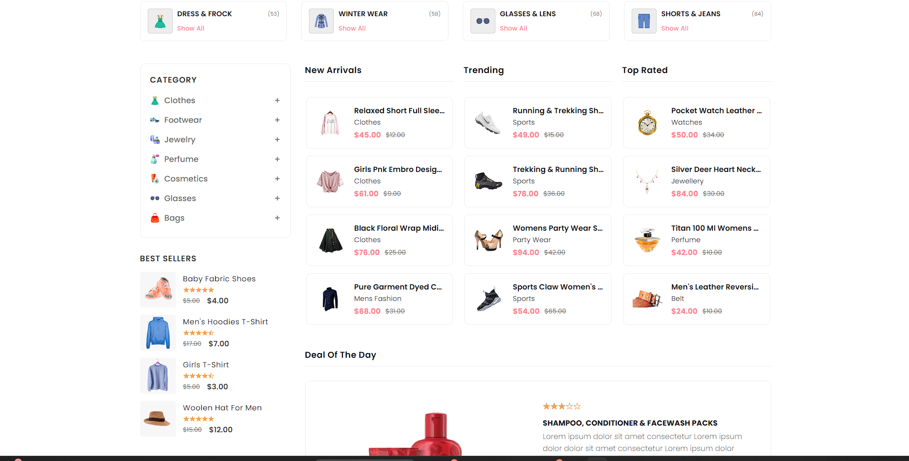
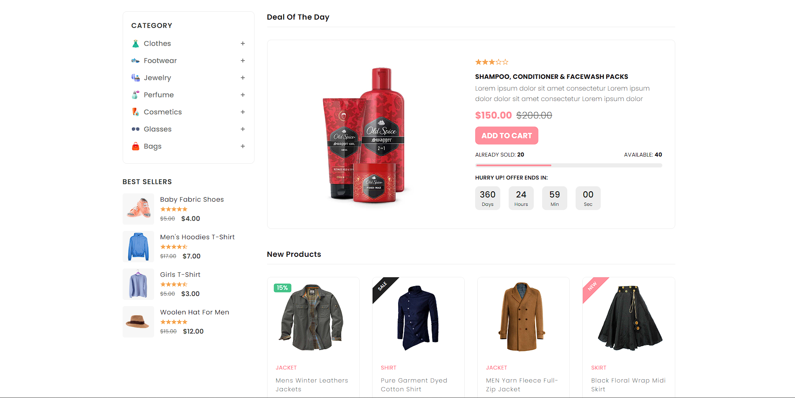
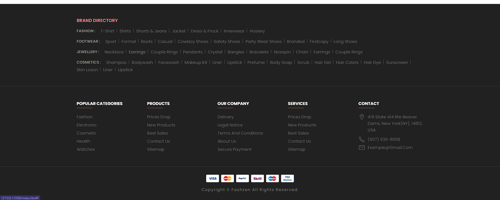
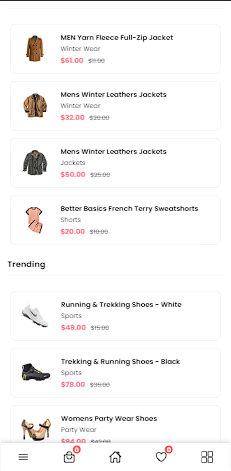
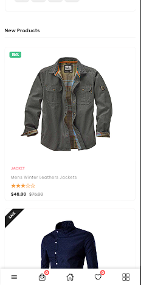
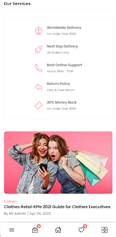
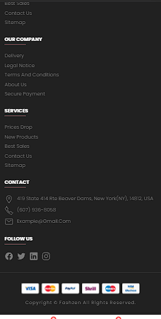

# Fashzen - An eCommerce Website

Fashzen is a fully responsive ecommerce website, maximum compatiblities in all mobile devices, built using HTML, CSS, and JavaScript.

## Images

Desktop view





Mobile view   








## Prerequisites

Before you begin, ensure you have met the following requirements:

* [Git](https://git-scm.com/downloads "Download Git") must be installed on your operating system.

## Installing Fashzen

To install **Fashzen**, follow these steps:

Linux and macOS:

```bash
sudo git clone https://github.com/khanimran17/e-commerce-store.git
```

Windows:

```bash
git clone https://github.com/khanimran17/e-commerce-store.git
```

